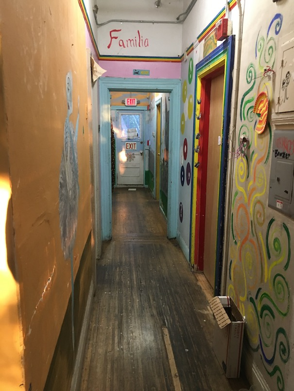
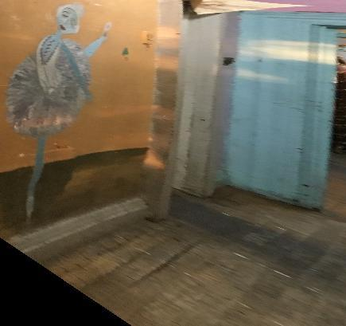
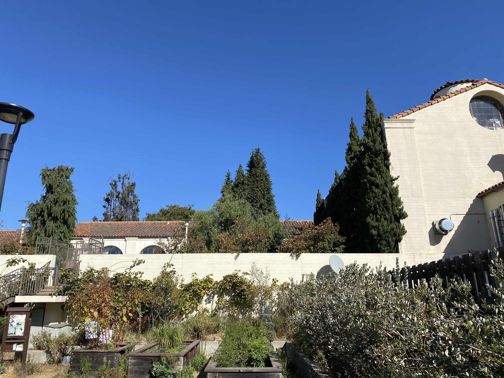
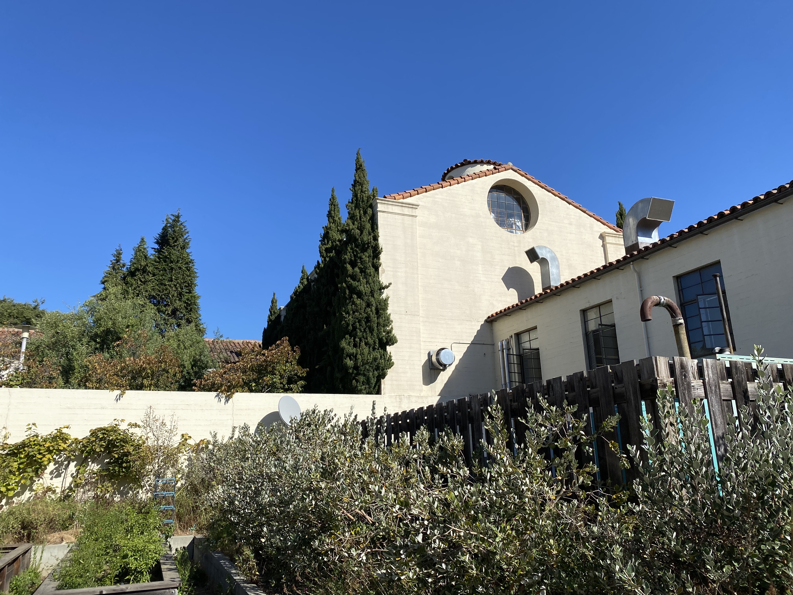
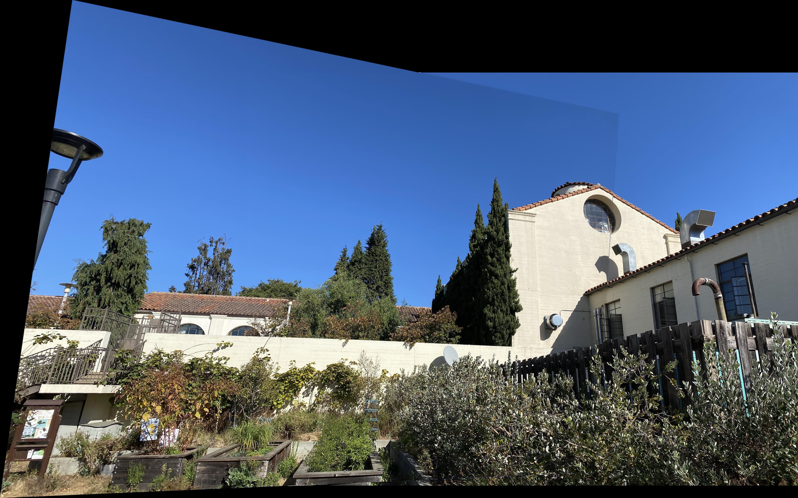
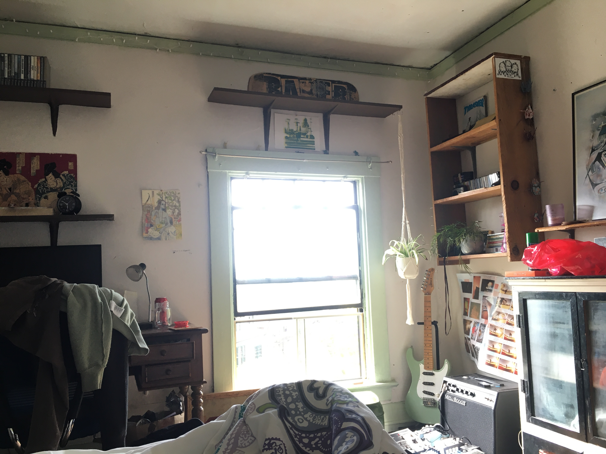
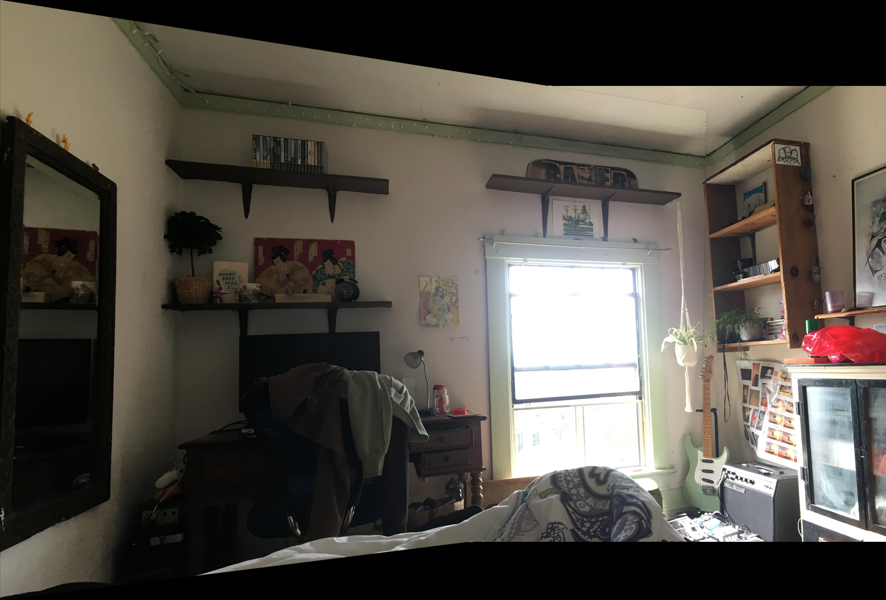

# Autostitching Panoramic Images

Python application for stitching panoramic images.

## Description

Implements stitching arbitrary images either through manually defined correspondences
or through feature matching based on the Harris corner detector, as described in [Brown et Al.](http://matthewalunbrown.com/papers/cvpr05.pdf) Stitching is accomplished by computing a homography matrix between the set(s) of image
correspondence, then warping each image toward a chosen reference image. Finally, multiresolution blending is accomplished using 
Laplacian pyramids. The application also supports rectangular image rectification.

## Usage

Requirements are listed in ```requirements.txt```. Application is run from ```main.py```: 

```bash
usage: main.py [-h] -r REF [-w WARP [WARP ...]] -m
               {rectify,manual_mosaic,autostitch} [-v]

optional arguments:
  -h, --help            show this help message and exit
  -r REF, --ref REF     reference image path
  -w WARP [WARP ...], --warp WARP [WARP ...]
                        warp image path(s)
  -m {rectify,manual_mosaic,autostitch}, --mode {rectify,manual_mosaic,autostitch}
                        choose between image rectification, manual
                        correspondence mosaic and autostitched mosaics
  -v, --verbose         log file reads/writes to stdout & visualize
                        intermediate autostitching outputs
```

Global filepaths for intermediate and final outputs are set in ```utils.py```. 

Note: Click same coordinate twice to end manual shape labelling.

## Examples

### Rectification

<table>
  <tr>
     <td>Hallway</td>
     <td>Hall Rectified</td>
  </tr>
  <tr>
    <td> </td>
    <td></td>
  </tr>
 </table>


### Mosaicing

<table>
  <tr>
     <td>Building Left</td>
     <td>Building Right</td>
     <td>Building Mosaic</td>
  </tr>
  <tr>
    <td></td>
    <td></td>
    <td></td>
  </tr>
  <tr>
     <td>Room Left</td>
     <td>Room Right</td>
     <td>Room Mosaic</td>
  </tr>
  <tr>
    <td></td>
    <td></td>
    <td></td>
  </tr>
 </table>

 
